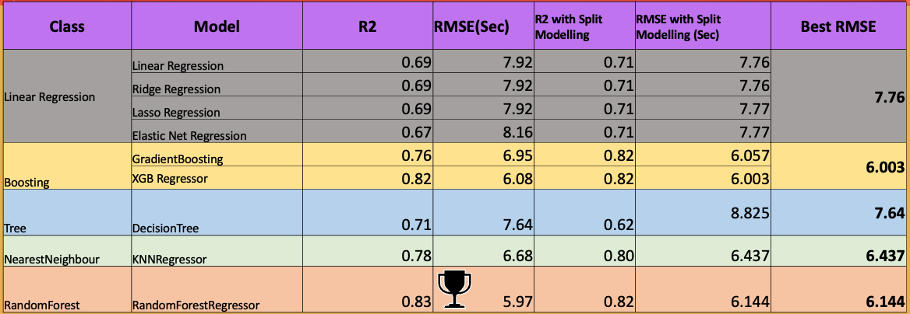

# Prediction of Handle Time of a Contact by an Agent in Webex Contact Center
Given an agent is assigned a contact, we want to pRedict how long it will take to handle the contact using metadata about an on-going interaction such as agent, skills, date and time, queue in which the call has landed, priority of contact, customer id, agent details etc.

## About The Data
From our systems we obtained data in various formats & after various relevant aggregations & filters we dumped it into csv. This is the starting point of consumption of this data. 
The columns are:
 1.   id
 2.   matchedSkills:  				subset of all the skills required for this contact among all the skills this agent has 
 3.   lastTeam: 					the team to which the agent belongs
 4.   requiredSkills: 				skill requirements from the contact
 5.   createdTime: 					time when the contact entered the system
 6.   endedTime: 					wrap up time of the contact(we will get rid of this in the subsequent data processing)
 7.   origin: 						customer's identifier(phone number, email-id, chat id)
 8.   destination: 					toll free route point destination where the customer connects
 9.   contactReason: 				only relevant in chat, denotes the reason for the cotnact
 10.  channelSubType: 				finer distinction among telephony, chat & email
 11.  channelType: 					telephony, chat & email
 12.  holdCount: 					number of times customer was put on hold
 13.  holdDuration: 				how long the hold episodes lasted
 14.  selfserviceCount: 			how many times customer encountered self service(IVR)
 15.  selfserviceDuration: 			how long the self-service episodes lasted
 16.  connectedCount: 				how many times this customer connected to an agent, can be multiple if he/she hopped among queues. 
 17.  connectedDuration: 			our prediction variable. How long customer and agent were connected.
 18.  ringingDuration: 				how long it took to connect to system
 19.  queueDuration: 				how long was customer waiting in queue
 20.  queueCount: 					how many times customer was queued
 21.  routingType: 					internal algorithm of the contact center
 22.  isHandledByPreferredAgent: 	one particular feature of the contact center where customers can choose their agent 
 23.  lastQueue: 					queue from which this agent picked up this contact
 24.  contributors: 				the agent
 25.  skillDiff: 					difference in skill b/w agent & contact's requirement
 26.  queue: 						queue(engineered column)
 27.  agent: 						agent(engineered column)
 28.  team: 						team(engineered column)
 29.  rs: 							required skill(engineered column)
 30.  ms: 							matched skills(engineered column)

This data is for a particular organisation using this contact center. Each row represents an interaction between an agent and a customer(contact). This contact center supports 3 media channels - telephony, chat & email.

NOTE: in the constants file you will notice two names frequently appearing - lion king and maersk. These are two orgs for which we got data initially. Finally we got proper data only for lion king and all our modelling are based on that.

## How to Execute the project
The project is designed to consume data from data.csv & go through various steps. Each of the steps are executed in a file. Following are the details:
1. `1_imputation.py` - consumes data.csv, does imputation, drops unneccesary columns, remove outliers, train test split & outputs `imputed_data_train.csv & imputed_data_test.csv`
2. `2_feature_engineering.py` - consumes `imputed_data_<test/train>.csv`, breaks created timestamp to year, month, week, day etc & outputs `engineered_data_train.csv & engineered_data_test.csv`
3. `3_encoding.py` - consumes `engineered_data_<test/train>.csv`, perform encoding for categorical columns and output `encoded_data_train.csv & encoded_data_test.csv`
4. `4_eda.py` - performs various EDA
5. `\model` folder contains a file for each model such linear regression, bagging, boosting, decision tree, random forest etc. In these there are two flavours, train on default parameters, or do training with hyper parameter tuning & come up with best parameters.
6. `all_model.py` - is a master file for training & evaluation of each model. One can do hyper parameter tuning here as well, or use the parameters found in the individual files. Finally we can also do split modelling based on the channel type of contact, because a email's connected duration will typically be very different from a telephony contact's connected duration.

Hence starting with data.csv we can progressively run each step of imputation, feature engineering, encoding, eda & finally modelling to get the results. Each step produces an output which is consumed by the next step and so on.

## Result
We observed RandomForestRegressor is giving us the best results on the data.
Our metrics were R2 and RMSE(Seconds)

## Authors
Biswarup Das Sarma(biswarup.cst@gmail.com)